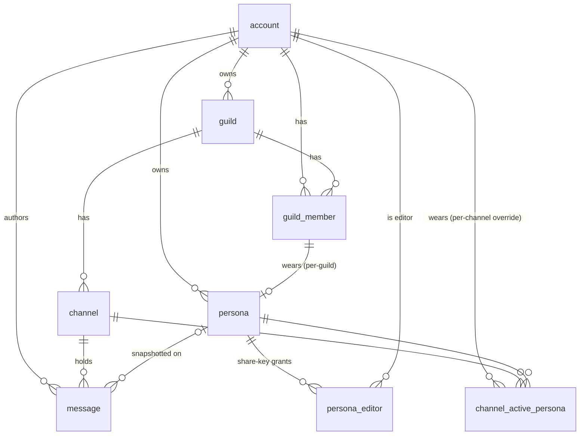

# authlyn-interactive — Architecture

> Canonical in-repo architecture map. Updated through Wave 7 (2026-05-28).
> Static structural reference; living state (status, backlog, decisions) lives
> in **ctx**, behavior-steering lives in `CLAUDE.md`.
>
> Relationship to other docs: `CLAUDE.md` is the thin orientation map and the
> permission-classifier surface; **ctx** holds the living/episodic knowledge
> (status, backlog, decision history). This file is the durable structural
> reference — the "how the crate is shaped and which rules hold" layer.

---

## 1. Purpose & scope

authlyn-interactive is a **self-hosted, server-trusted** roleplay chat
platform — Discord's guild/channel/membership shape crossed with
SillyTavern's personas + lorebook. Solo project, one deployment target
(novahome via DDNS).

**Server-trusted** is the defining property, post the 2026-05-25 pivot away
from E2EE: the server stores plaintext content and **is the source of truth
for attribution and authorization**. The client is never trusted to assert
who it is or what it may do:

- **Identity** comes from the session cookie, resolved server-side to an
  account id by the `AuthAccount` extractor (§4). There is no client-supplied
  user id on any request.
- **Attribution** (which account, and which "speaking-as" persona, owns a
  message) is decided **on the server at send time** and snapshotted onto the
  row. The client may *suggest* a persona (`SendMessageRequest.persona_id`),
  but the server validates the caller actually may wear it
  (`can_edit_persona`) before accepting; an invalid/absent suggestion falls
  back to the stored per-channel persona, else to the bare account.
- **Authorization** is re-derived server-side on every mutating request from
  guild role + channel membership + persona ownership — never read from the
  request body. Non-membership is rendered indistinguishable from
  non-existence (the privacy-404 rule, §5/§6).

Out of scope here: deployment runbook (ctx: `novahome deploy commands`),
current backlog and wave plan (ctx: `authlyn current status`).

**Product tour.** A user signs into one server (the deployment) and joins
one or more **guilds** (Discord's "server" concept) — each guild owns
**channels**, of which two kinds exist: `text` (a normal message stream) and
`lorebook` (a member-collaborative card collection, not a chat). A user also
has account-global **personas** — characters with name, avatar, description,
palette colour, and a `wardrobe` gallery — and may "wear" one per guild (or
override per channel) so their messages post under that identity. Personas
can be shared with **friends** via a redeemable share-key, granting edit +
wear. Guild-scoped custom **emoji** (`:name:`) augment Unicode shortcodes.
**Web Push** delivers @-mention notifications when the tab is closed (#30).
**Feedback** lets any user file a bug/idea report; admins read/clear the
queue (#31).

---

## 2. Crate layout

**Single Rust crate** (`authlyn-interactive`), `crate-type = ["cdylib",
"rlib"]`: the same source compiles to a native SSR server binary *and* to the
`wasm32-unknown-unknown` hydrate bundle, gated by Cargo features (§3). A
second, standalone binary (`nova-mcp`) lives in the same crate but never
enters the app graph.

`recursion_limit = "512"` is set crate-wide in both `src/lib.rs` and
`src/main.rs`: the deeply-nested Leptos `AppShell` view type overflows the
default type-layout recursion limit when the release profile computes the
async hydration layout. Harmless for SSR; required for hydrate.

Module tree, grouped by where each module is allowed to run:

```
src/
├── lib.rs                  # crate root: module decls + #[wasm_bindgen] hydrate() entry
├── main.rs                 # ssr server bin (#[cfg(ssr)]); builds AppState, mounts router + Leptos
│
│  ── SHARED (compile for BOTH ssr and hydrate; must be wasm-clean) ──
├── protocol.rs             # wire-format DTOs (serde only — no axum/surreal/tokio). §7
├── markup.rs               # roleplay rich-text parser → AST. Target-agnostic, panic-free. §6
├── app.rs                  # Leptos app root: shell(), <App/>, router + routes
├── client/
│   ├── mod.rs              #   browser REST client namespace
│   └── api.rs              #   gloo-net Fetch wrappers (#[cfg(hydrate)] — see note)
└── ui/                     # Leptos components (render for ssr + hydrate; data-fetch is cfg(hydrate))
    ├── mod.rs              #   AuthCtx + shared UI context
    ├── auth.rs             #   login / register / reset pages
    ├── avatar.rs           #   shared avatar component (initials fallback)
    ├── clipboard.rs        #   `read_pasted_images` paste-helper (#[cfg(hydrate)]; W7/B2)
    ├── inline_rename.rs    #   shared inline-edit text component (W6/C7)
    ├── markup_view.rs      #   renders markup::Node AST → styled spans
    ├── modal.rs            #   shared Modal component w/ Esc + focus-trap (W6/C10)
    ├── emoji/{mod,data}.rs #   emoji picker + the phf shortcode dataset (data.rs is cfg(hydrate))
    └── shell/              #   the logged-in app shell (rail, sidebar, channel, panes)
        ├── mod.rs          #     Home + AppShell entry + provide_context(Shell) (W6/C4)
        ├── state.rs        #     Shell sub-structs (selection/messages/composer/edit/…) (W6/C4)
        ├── act/            #     action-functions: account · channel · emoji · feedback ·
        │                   #       guild · message · notify · persona · prefs
        ├── channel/        #     message list + composer · attachments · avatar ·
        │                   #       emoji_suggest · meta (W6/C9)
        ├── wardrobe.rs     #     persona management + gallery (paste-many via clipboard, W7/B4)
        ├── members.rs · friends.rs · lorebook.rs · emoji_manager.rs · account.rs
│
│  ── SSR-ONLY (#[cfg(feature = "ssr")]; never in the wasm bundle) ──
├── db.rs                   # SurrealDB connect() + schema apply + retry-aware query exec
├── storage/
│   ├── mod.rs              #   pub const SCHEMA = include_str!("schema.surql")
│   └── schema.surql        #   the canonical DB schema (all tables/indexes). §5
└── server/                 # axum: AppState, router, handlers, extractors
    ├── mod.rs              #   AppState re-export, route table, body-limit groups, purge sweep. §4
    ├── state.rs            #   AppState (db handle, canonical media_dir, typing map, push sender)
    ├── errors.rs           #   `error_response` / `json_rejection_response` (W2 hoist). §4/§7
    ├── permissions.rs      #   guild role gates · persona edit-access · admin guard (W2). §6/§7
    ├── access.rs           #   shared `resolve_membership` channel→guild→member (W2). §7
    ├── validate.rs         #   `validate_name` (chars) + `validate_emoji_name` (bytes) (W2). §7
    ├── db_helpers.rs       #   `IdRow { id_key }` shared projection target (W2). §7
    ├── retry.rs            #   write-conflict / unique-violation retry (substring matchers). §6
    ├── datetime.rs         #   raw SurrealDB Datetime → fixed-9-digit RFC3339 (private). §6
    ├── auth/               #   accounts + sessions (W3 split):
    │                       #     session (AuthAccount) · registration · password · admin · crypto
    ├── guilds/             #   guilds + channels + members (W3 split):
    │                       #     mod (CRUD) · channels · membership · deletion
    ├── messages/           #   messages (W3 split):
    │                       #     mod (channel_access · caps) · posting · reading · editing · typing
    ├── personas/           #   personas (W3 split):
    │                       #     mod · core · editors · gallery · wear
    ├── lorebook.rs · friends.rs · emoji.rs · media.rs · push.rs · feedback.rs
│
│  ── NOVA (the `nova` feature only; standalone, native-only) ──
└── bin/nova-mcp.rs         # MCP bridge: talks to the running authlyn HTTP API as "Nova"
```

> Note on `client::api`: the `client` module is *declared* unconditionally in
> `lib.rs`, but its only child, `api`, is `#[cfg(feature = "hydrate")]`. So the
> gloo-net Fetch client compiles only into the wasm bundle, never SSR. The
> same hydrate-gating-at-the-mod-decl pattern is used for `ui::clipboard`
> (web-sys-only helpers).

---

## 3. The three feature sets

The crate has three disjoint build personalities. Two (`ssr`, `hydrate`) are
the two halves of the app; the third (`nova`) is an unrelated side binary.

| Feature   | Builds                | Target            | Pulls (dep groups) |
|-----------|-----------------------|-------------------|--------------------|
| `ssr`     | server binary         | native            | axum, tokio, leptos_axum, **surrealdb**, tower-http, bytes, tracing(+subscriber), chrono, argon2, axum-extra, time, image, web-push; `leptos/ssr`, `leptos_meta/ssr`, `leptos_router/ssr` |
| `hydrate` | wasm bundle           | `wasm32-unknown-unknown` | console_error_panic_hook, wasm-bindgen(+futures), js-sys, web-sys, gloo-net, gloo-storage, gloo-timers, **emojis**; `leptos/hydrate` |
| `nova`    | `nova-mcp` bin        | native            | rmcp, reqwest, anyhow, axum, tokio(+macros/net/signal/rt), tracing(+subscriber) |

Always-on (no feature gate): `leptos`, `leptos_router`, `leptos_meta`,
`serde`, `serde_json`, `base64`, `hex`, `sha2`, `rand`, `thiserror`.
`serde_json` is always-on **on purpose**: `protocol.rs` is shared and its DTOs
are wire-format JSON. On `wasm32`, `getrandom` gets the `js` feature so
`rand` can borrow the browser's `crypto.getRandomValues`.

### The disjointness invariant

This is load-bearing, not stylistic:

1. **`ssr` ↔ `hydrate` never cross.** No code path may require both. Server
   deps (surrealdb, axum, tokio, argon2, image, web-push, …) must **never**
   enter the wasm bundle — they don't compile to `wasm32` and would bloat or
   break the download. Browser deps (gloo-\*, web-sys, js-sys, emojis) must
   never enter the SSR graph. The lint gate runs clippy on **both**
   `wasm32` and the SSR target so a leak fails CI-equivalently
   (`./scripts/precommit.sh`).
2. **`protocol.rs` and `markup.rs` must stay wasm-clean.** They are the shared
   spine: both compile under both features, so they may depend only on
   `serde` / `std` — never on axum, surrealdb, tokio, gloo, or web-sys. A
   server-only import sneaking into either one breaks the wasm build. (This is
   also why `markup.rs` must be panic-free on arbitrary input — see §6.)
3. **`nova` is graph-isolated.** The `nova-mcp` bin is
   `required-features = ["nova"]`, so the default build and `cargo leptos
   build` never compile it. It links no Leptos/app code; it is a thin HTTP→MCP
   bridge that talks to the running server over loopback.

The SSR/hydrate split is realized in-source by `#[cfg(feature = "ssr")]` /
`#[cfg(feature = "hydrate")]` gates (the audit counted ~59 such sites with
zero ssr↔hydrate leak). The pattern in `ui/`: components render under both
features, but every data-fetch body is wrapped in `#[cfg(feature =
"hydrate")]` (empty closure under SSR), so the Fetch client never enters the
SSR graph.

---

## 4. Request lifecycle (API request → JSON)

The axum app is assembled in `src/server/mod.rs`. `main.rs` builds the
`AppState`, calls `server::api_router()`, and merges the Leptos SSR handlers on
top; the integration tests call `server::make_router(state)` and drive it via
`tower::ServiceExt::oneshot` without binding a port.

**1 — Router & layers.** Routes split into two **body-limit groups**, because
`RequestBodyLimitLayer` composes with min-limit semantics (a larger inner cap
under a smaller outer one still rejects at the smaller one), so the two caps
must live on disjoint route groups:

- `small_body_routes()` — all JSON API routes, under
  `REQUEST_BODY_LIMIT_BYTES` (**512 KiB**), plus a
  `map_response` layer that stamps **`Cache-Control: no-store`** on every JSON
  response (a cached message list once flashed ancient messages on cold open).
- `media_routes()` — `POST /media` upload + `GET /media/{id}`, under
  `MEDIA_BODY_LIMIT_BYTES` (64 MiB). Also raises axum's own `DefaultBodyLimit`
  to the same cap (min wins, or the ~2 MB default would silently truncate
  phone photos).

**2 — Auth extraction.** Every mutating handler takes the
`AuthAccount(pub String)` extractor (`server/auth/session.rs`, re-exported as
`crate::server::auth::AuthAccount`). Its `FromRequestParts` impl reads the
`authlyn_session` cookie, SHA-256-hashes the token, looks up the unexpired
`session` row, and yields the **bare account key**
(`meta::id(id)` form, e.g. `"abc123"`). Missing/expired/garbage cookie → `401`
with an `ErrorBody`; a storage error → `500`. The only public handlers (no
`AuthAccount`): `register`, `login`, `logout`, `get_reset_question`,
`confirm_password_reset`, `vapid_key`.

**3 — Handler.** Handlers are named **`verb_noun`** (`create_guild`,
`list_messages`, `set_member_role`) — there is **no `handle_` prefix anywhere**
(verified). A handler validates input, re-checks authorization server-side
(role / membership / ownership — §6), runs its SurrealDB queries, maps rows to
DTOs, and returns JSON.

**4 — Storage query.** Queries project the row's id as the bare key via
`meta::id(id) AS id_key` (the projection appears ~70× across handlers, the
`id_key` field ~95×) so DTOs carry opaque string ids, never SurrealDB
`Thing`/`RecordId` values. Datetimes that drive ORDER BY / cursors are
projected raw and formatted Rust-side (§6, invariant 7).

**5 — Response & error path.** Success → `Json<…Response>` /
`Json<…Envelope>` (§7). Every handler builds 4xx/5xx replies through the two
helpers in `server/errors.rs` (W2 hoist; one definition shared by every
handler module):

- `error_response(status, msg)` → `(status, Json(ErrorBody::new(msg)))` —
  `ErrorBody` is `{"error": "<reason>"}` (`protocol.rs`).
- `json_rejection_response(rej)` maps an axum `JsonRejection` (bad
  Content-Type, malformed / mis-shaped JSON, unreadable body) to a `400` with
  a stable human reason — so a deserialize failure never leaks as a `500`.

```
cookie ──▶ AuthAccount (FromRequestParts) ──▶ verb_noun handler
   │  401 on bad/expired                            │
   │                                                ├─ authz re-check (§6)
   │                                                ├─ SurrealDB query (meta::id → id_key)
   │                                                └─ rows → DTO
   ▼                                                ▼
ErrorBody  ◀── error_response / json_rejection_response      Json<…Response>
```

The reference shape — `AuthAccount` → JSON-rejection guard → input validation
→ retry-wrapped SurrealDB transaction → `201` with a typed DTO — reads
cleanest in `create_guild` (`src/server/guilds/mod.rs`); use it as the
canonical example when introducing a new mutating handler. The route table
itself lives in `server/mod.rs::small_body_routes`; W7 added one route to it
(`POST /personas/{id}/gallery/batch`), but the request lifecycle above is
unchanged.

---

## 5. Data model

Defined in `src/storage/schema.surql`, applied on every boot by
`db::apply_schema` (all `DEFINE … IF NOT EXISTS`, so re-apply is a no-op). All
tables are `SCHEMAFULL`. `record<…>` links are **type annotations only** —
SurrealDB does not enforce referential existence — so a link may dangle (e.g.
`message.persona` after the persona is deleted; the snapshot fields are the
display source of truth).

Tables and their key relationships:

| Table | Holds | Key links / indexes |
|-------|-------|---------------------|
| `account` | username (+ lowercased `username_ci`), argon2id `password_hash`, display_name, optional avatar, optional security question/answer-hash | UNIQUE `username_ci` |
| `session` | server-side session: SHA-256 `token_hash`, `expires_at` | → account; UNIQUE `token_hash` |
| `media_blob` | server-visible image metadata (mime, size, on-disk `storage_path`) | → account (uploader) |
| `persona` | account-global character: name, description, color, optional avatar, `share_key`, `position` | → account (owner); index owner, share_key |
| `persona_editor` | share-key grant (edit+wear, not delete/share) | → persona, → account; UNIQUE (persona, account) |
| `persona_image` | persona gallery image, `position`-ordered | → persona, → media_blob |
| `guild` | server: name, owner, optional icon, `deleted_at` | → account (owner) |
| `channel` | nested under a guild: name, `kind` ∈ {text, lorebook}, `position`, `deleted_at` | → guild; index guild |
| `guild_member` | membership + `role` ∈ {owner, admin, member} + per-guild `active_persona` | → guild, → account; UNIQUE (guild, account) |
| `channel_active_persona` | per-channel "worn" persona (supersedes the per-guild one) | → account, → channel, → persona; UNIQUE (account, channel) |
| `message` | channel-scoped plaintext `body`, live `persona` link **+ snapshotted** persona_name/description/color/avatar, `attachments` (array of media ids), `tier`, `deleted_at`, `sent_at` | → channel, → account; index (channel, sent_at) |
| `lorebook_entry` | on a `kind='lorebook'` channel: title, `keys`, content, enabled, `position` | → channel; index channel |
| `friendship` | one directed row, `state` ∈ {pending, accepted}; reverse-pending auto-accepts | → account ×2; UNIQUE (requester, addressee) |
| `feedback` | user report: kind, body, optional context JSON, status | → account (author); index created_at |
| `push_subscription` | one row per browser push endpoint + receiver keys (p256dh, auth) | → account; UNIQUE endpoint |
| `user_guild_order` | per-account guild-rail position | → account, → guild; UNIQUE (account, guild) |

**Persona attribution snapshotting.** A message is an immutable historical
utterance. `persona` stays a live link, but `persona_{name,description,color}`
+ `persona_avatar` are **frozen at send time** so renaming or deleting the
persona never scrambles the name/avatar on past messages.

**Soft-delete + purge windows.** `guild`, `channel`, and `message` carry
`deleted_at option<datetime>` (`NONE` = live; a datetime = when trashed).
**Every read filters `deleted_at = NONE`.** A purge sweep
(`purge_soft_deleted`, `server/mod.rs`) hard-deletes rows past their rollback
window — **message 1h / channel 1d / guild 30d** — cascading a purged
channel's messages and a purged guild's channels/members/messages. It runs
once shortly after boot, then hourly; idempotent.

**Privacy-404 rule.** Membership/ownership is checked server-side, and
**non-membership is rendered indistinguishable from non-existence**: an
unknown guild/channel/persona/message and one the caller simply can't see both
return the same `404` ("not found"), so the API never confirms a private
resource exists to a non-member. (Stated precisely as invariants 4 & 6 below.)

**The NONE-coercion trap (operational note).** Adding a non-`option<>` field
to a `SCHEMAFULL` table that already has rows makes old rows hold `NONE` there;
because **any** `UPDATE` re-validates **all** fields, the next unrelated update
trips "Expected … but found NONE" and crash-loops schema apply. The schema
defends against this with idempotent backfill `UPDATE`s (see the `persona`,
`account.display_name`, and `message.attachments` backfills, and note the
attachments backfill must precede the persona one). Prefer `option<>` for
fields added post-hoc.

**ER diagram (load-bearing links only).** The table above is the full
catalogue; this small mermaid sketch shows just the core that drives every
message: who authors it, where it lives, and which persona's identity it
carries.



---

## 6. Load-bearing invariants

This file is the **canonical in-repo home** of the invariant gate. The
15-point list below is reproduced from the systems audit
(ctx `019e6c08`); every change must preserve all 15. Anything mutating these
needs an explicit decision, not a silent refactor.

1. **Auth coverage.** Every mutating route extracts `AuthAccount`. The only
   public handlers: `register`, `login`, `logout`, `get_reset_question`,
   `confirm_password_reset`, `vapid_key`.
2. **Guild structural authz.** `delete`/`restore_guild` require owner; channel
   CRUD + invite + kick + rename + guild PATCH require owner-OR-admin
   (`require_manager`); the owner is never kickable and the owner role is
   immutable.
3. **Persona ownership.** edit/wear gated by `can_edit_persona` (owner OR
   editor); editor-roster + share-key are owner-only; `add_editor` only to an
   accepted friend.
4. **Channel membership gate is per-guild & non-leaky.**
   `channel_access`/`check_access`/`is_channel_member` map unknown-channel AND
   non-member both → `404` "channel not found"; `require_own_message`
   collapses stranger-msg + missing-msg → `403`.
5. **Lorebook scope.** Member-writable on `kind='lorebook'` channels only
   (collaborative; no per-entry owner).
6. **Privacy-404 everywhere.** Non-member == non-existent
   (guilds/channels/personas/messages/lorebook); unknown-user vs wrong-secret
   are indistinguishable on login + both password-reset paths.
7. **Datetime-ordering.** NEVER `<string>`-cast a datetime feeding
   ORDER BY/cursor. Project the raw `Datetime`, bind cursors via
   `type::datetime(...)`, ORDER BY the projected aliases, and format Rust-side
   via `to_rfc3339_fixed` (`SecondsFormat::Nanos`, fixed 9 digits). The
   message cursor is the composite `(sent_at, id_key)` with a strict tie-break.
8. **No user input string-interpolated into SQL.** Dynamic SET/CREATE clauses
   splice only static fragments / loop indices; all values go through
   `.bind()`. (5 sites: personas.rs, lorebook.rs, guilds.rs ×2, messages.rs.)
9. **Session cookie.** `HttpOnly + Secure + SameSite=Lax + Max-Age=30d`; the
   DB stores only the SHA-256 of the token; argon2id runs on the blocking
   pool; a password reset invalidates all of the target's sessions.
10. **Media path-traversal.** Server mints random on-disk names; `GET`
    canonicalizes the path and asserts `canonical.starts_with(media_dir)`;
    `media_dir` is canonicalized **once** at `AppState` construction.
11. **Admin gate fail-closed.** `AUTHLYN_ADMIN_USERNAMES` ∪ legacy
    `AUTHLYN_ADMIN_USERNAME`; an empty set authorizes **no one**; enforced on
    `admin_reset_password` + feedback list/delete.
12. **`markup.rs` panic-free.** Panic-free on **any** input
    (unknown/unterminated markup → literal text); no `expect`/`unwrap` on
    untrusted-data shape; UTF-8-boundary-safe.
13. **Unique-violation → 409/idempotent (not 500).** At every concurrent-write
    site; `with_write_conflict_retry` wraps racy `CREATE`s. Both
    substring matchers in `retry.rs` (`is_write_conflict`,
    `is_unique_violation`) are load-bearing — on the pinned SDK there is no
    typed variant, so they match SurrealDB error message text. A message
    rename silently disables retry with no compile signal (the Wave 1
    `retry_canary` test guards this).
14. **Purge windows preserved.** `purge_soft_deleted` keeps message 1h /
    channel 1d / guild 30d (`server/mod.rs`); all reads filter
    `deleted_at = NONE`.
15. **Green gate.** `./scripts/precommit.sh` stays green (fmt + clippy-ssr +
    clippy-wasm32 + check-no-remnants); lib unit tests stay ≥ 37 passing.

### Client-side behaviors to preserve

The frontend has its own set of "do not regress" behaviors (the gate for any
UI refactor — Waves 4/6). Verified from the audit; keep them when moving code:

- **Poll change-detection** — write the messages signal only when the content
  actually changed, or the channel flickers on every idle poll.
- **Caret splice uses UTF-16 / JS-string offsets** with a deferred
  `set_selection_range` (composer) — do **not** convert to Rust byte offsets.
- **Touch Enter-handling** — on a coarse pointer, Enter inserts a newline and
  the Send button is the sole send path; an IME `is_composing` guard suppresses
  send mid-composition; the emoji popover owns Arrow/Enter/Tab/Esc while open;
  Send clears the autocomplete token.
- **Three-cursor pagination** — `cursor` / `oldest` / `last_seen` plus a seen
  set for dedup; first page opens at the **newest** 100.
- **Optimistic reorder** — guild rail / channel list / persona wardrobe reorder
  locally, then reconcile.
- **`PendingDelete` carries data, not a closure** (so the confirm modal
  survives re-render).

**Anchor tests.** Each invariant has an integration-test anchor in `tests/`
(run via `./scripts/dev-db.sh` + `cargo test --features ssr`):
inv 1/2/3/4/6 — the per-domain handler suites (`auth.rs`, `guilds.rs`,
`personas.rs`, `messages.rs`, `lorebook.rs`, `friends.rs`); inv 7 — the
composite-cursor pagination canary in `messages.rs`; inv 9 — the
cookie/session shape in `auth.rs`; inv 10 — `media.rs` (path-traversal
defense in depth); inv 11 — `feedback.rs` (admin fail-closed); inv 13 —
`retry_canary.rs` (the SurrealDB error-string matchers, pinned against
live DB errors); inv 14 — `soft_delete.rs` (soft-delete + restore + purge
cascade); inv 15 — `cache_control.rs` (JSON `Cache-Control: no-store`).
Invariants 5, 8, 12 are defended in-code: lorebook scope is a kind-gate in
`lorebook.rs`; the no-SQL-interpolation rule is a maintained discipline (the
5 dynamic-fragment sites listed in inv 8 are the audited surface); markup
panic-freedom is covered by `markup.rs`'s in-module unit tests.

---

## 7. Conventions

**DTO suffixes** (`src/protocol.rs` — the wire contract, serde-only, wasm-clean):

| Suffix | Meaning | Examples |
|--------|---------|----------|
| `…Request` | request body in | `CreateGuildRequest`, `SendMessageRequest`, `PatchPersonaRequest`, `AddGalleryImagesBatchRequest` |
| `…Response` | response body out (often a wrapper around a `Vec`) | `AuthResponse`, `ListGuildsResponse`, `SendMessageResponse`, `AddGalleryImagesBatchResponse` |
| `…Summary` | one item as it appears **in a list** (compact) | `GuildSummary`, `ChannelSummary`, `MemberSummary`, `PersonaSummary`, `FriendSummary` |
| `…Detail` | one item with its **full nested payload** (single-item GET) | `GuildDetail` (+ channels), `PersonaDetail` (+ gallery) |
| `…Envelope` | one rich record in a stream/list with snapshot + derived fields | `MessageEnvelope` |
| `…Item` | one row in an admin/flat list | `FeedbackItem` |
| `…Entry` | one lorebook record | `LorebookEntry` |
| (bare) | a value object reused across DTOs | `Attachment`, `GalleryImage`, `PersonaEditor`, `PushSubscriptionKeys`, `ErrorBody` |

DTOs `PATCH`-shaped (partial update) derive `Default` and make every field
`Option<…>`. `#[serde(default)]` guards fields added after a DTO shipped so
older clients / the trash responses stay wire-compatible. The server stores
message/lorebook `body` text **verbatim** — markup rides inside it and is
parsed only at render (`markup.rs` → `ui/markup_view.rs`).

**Handler naming.** `verb_noun`, lowercase, no prefix — `create_guild`,
`list_deleted_channels`, `set_channel_active_persona`. The audit confirmed
**zero `handle_` prefixes** in `server/`. Route paths are REST-shaped; a
static segment that must out-rank a `{param}` is declared as a literal route
(e.g. `/guilds/trash` wins over `/guilds/{id}`, `/messages/trash` over
`/messages/{mid}`) — axum routes static-over-dynamic regardless of order.

**Id convention.** Handlers project ids as the bare key
(`meta::id(id) AS id_key`) and surface them as opaque `String`s in DTOs;
SurrealDB `Thing`/`RecordId` values never reach the wire.

**Shared helper layers.** Wave 2 hoisted the cross-cutting helpers into
dedicated server-internal modules; every handler module imports from them
rather than carrying a local copy.

- `server/errors.rs` — `error_response(status, msg) -> Response` builds the
  canonical `{"error": "<reason>"}` body; `json_rejection_response(rej)`
  maps an axum `JsonRejection` to a stable `400` with a human reason. Both
  are `pub(crate)`; the wire shape is `ErrorBody` (`protocol.rs`).
- `server/permissions.rs` — guild role gates (`caller_role`,
  `require_manager`, `require_owner`); the persona-access cluster
  (`owns_persona`, `is_persona_editor`, `can_edit_persona`); the
  fail-closed admin guard (`is_admin`, `admin_username_set` — env-driven
  `AUTHLYN_ADMIN_USERNAMES` ∪ `AUTHLYN_ADMIN_USERNAME`, empty set
  authorizes no one).
- `server/access.rs` — `resolve_membership(state, cid, account,
  filter_deleted) -> Membership` (`Member { kind } | ChannelNotFound |
  NotMember`); the one varying knob is `filter_deleted` (lorebook resolves
  without the soft-delete filter, by current contract — do not collapse
  without a decision). `messages::channel_access` layers on top to fold
  the per-channel active-persona read into the same round-trip.
- `server/validate.rs` — `validate_name` (guild/channel/persona; bounded
  by **character count**, 100) and `validate_emoji_name` (bounded by
  **byte length**, 2..=32, `[a-z0-9_]` only). Kept distinct on purpose;
  do not unify.
- `server/db_helpers.rs` — `IdRow { id_key: String }`, the deserialize
  target for the `meta::id(id) AS id_key` projection used pervasively for
  existence checks and write-back.

**Shared UI helpers.** `ui/clipboard.rs::read_pasted_images(&ClipboardEvent)
-> Vec<File>` is hydrate-only (gated at the `pub mod` declaration in
`ui/mod.rs`), shared by the composer's paste-to-upload (W7/B2) and the
persona-gallery paste-many (W7/B4). `ui/modal.rs` is the shared accessible
Modal (W6/C10: Esc + focus-trap + initial-focus); `ui/inline_rename.rs` is
the shared inline-edit text field (W6/C7).

**`client/api.rs` rustdoc convention.** Every `pub async fn` in
`src/client/api.rs` documents itself as "HTTP verb + path + meaning of
response" (W7/C2, ~67 functions). Treat that as the contract when adding a
new Fetch wrapper.
